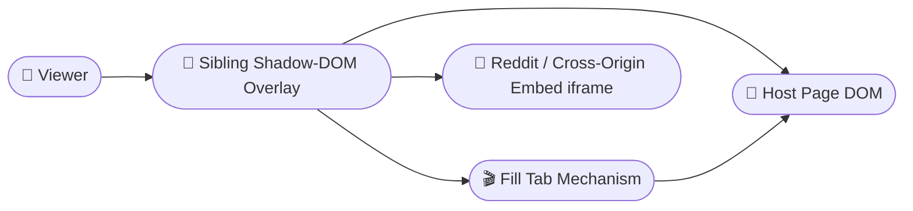

# Fit Video to Tab | Fábio R. Nóbrega

This project is a **Chrome extension** (Manifest V3, plain JS, no build step) that adds a small "Fill" button next to every `<video>` on a page, letting you expand any video to fill the browser tab — even on sites like x.com/Twitter where the video is buried inside `overflow: hidden` / `transform` wrapper `div`s that would otherwise clip it, or Reddit, where the player lives inside a Shadow DOM or a cross-origin embed iframe (RedGIFs, Imgur, Streamable).

The project's core innovation is that it works **without touching the host page's own DOM structure**: no wrapper element is inserted around the video and no node is moved, so it's safe on framework-managed pages (React, Vue, etc.) that reconcile their own subtrees.

---

## Table of contents

* [Setup](#setup)
* [Usage](#usage)
* [Architecture](#architecture)
* [How It Works](#how-it-works)
* [Testing](#testing)
* [Known Limitations](#known-limitations)
* [Git Guideline](#git-guideline)

---

## Setup

### 1. Clone and Load

Clone the repository, then load it as an unpacked extension in developer mode — there's no build step and nothing to install:

1. Open `chrome://extensions` (or `vivaldi://extensions` / `edge://extensions` on another Chromium-based browser).
2. Turn on **Developer mode** (toggle, top-right of the page).
3. Click **Load unpacked**.
4. Select this repository's `extension/` folder.
5. Confirm the "Fit Video to Tab" extension card appears with no errors.

### 2. Updating While Developing

After editing any file in `extension/`, go to `chrome://extensions` and click the reload icon (⟳) on the extension's card, then refresh the page you're testing on.

---

## Usage

1. Open any page with a `<video>` element (a plain HTML5 video page, youtube.com, a tweet on x.com with a video, or a Reddit video post).
2. A small circular Fill icon appears over the video's top-left corner.
3. Click it — the video fills the tab, cropped via `object-fit: cover`, while the browser's own chrome (tabs, address bar) stays visible. Move the pointer over the video to reveal the bottom control bar (play/pause, mute, scrub, standard repeat, A/B loop, exit); it fades out again after a couple of seconds of no movement.
4. Drag left/right on the filled video (mouse, touch, or pen) to pan the cropped content horizontally.
5. Press `Escape` or click the bar's Exit button to return to the normal in-page view — the crop resets to center and the floating Fill icon reappears for next time.

---

## Architecture



**Stack Summary**
- **Manifest:** Chrome Extension Manifest V3
- **Scripts:** Plain JS content scripts, no `chrome.*` API dependency in the core logic
- **Overlay:** Single sibling `<div>` with an open Shadow DOM, glued to each video via `getBoundingClientRect()`
- **Testing:** Playwright (real Chromium) inside Docker, driven by a `Makefile`

---

## How It Works

- A single sibling `<div>` (with an open Shadow DOM) is appended to `<body>` to host the buttons, kept visually glued to each video via `getBoundingClientRect()` — it never affects the page's own layout.
- Video discovery also descends into any *open* Shadow DOM on the page (e.g. Reddit's custom player element), scanning and observing each one separately, since neither `querySelectorAll` nor `MutationObserver` cross a shadow boundary on their own. Closed shadow roots can't be reached from a content script at all — a browser-level limit, not something this extension can work around.
- Clicking "Fill" adds a `position: fixed`, viewport-sized class (`object-fit: cover`) directly to the video — it fills the tab's content area, keeping the browser's own tab/address-bar chrome visible (unlike the native Fullscreen API, which was tried and rejected — see the spec's Problem Statement for why). To reach the true viewport, and to paint above the host page's own UI (e.g. a fixed header/sidebar) instead of underneath it, any ancestor that would clip, reposition, or out-rank the video in stacking order is temporarily neutralized while filled and restored exactly on exit. Clipping overrides (`overflow`, `transform`, etc.) stop the moment they'd reach an ancestor shared by more than one video (e.g. an infinite-scroll timeline's list container), so filling one video never un-clips or repositions another; stacking overrides (`z-index`, `position`, `opacity`, etc.) keep going past that point, since they only change paint order and can't reveal another video.
- Before it's filled, each video gets a small circular Fill icon over its top-left corner. Once filled, native `controls` are hidden and that icon hides too — a bottom control bar fades in on movement instead, with play/pause, mute, a progress scrubber, standard repeat, A/B loop points, and Exit; it fades out again after ~2 seconds of no pointer activity (and never hides mid-scrub).
- Exiting (via `Escape` or the bar's Exit button) restores the video's original `controls` state, every neutralized ancestor's original inline style, and brings the floating Fill icon back.
- While filled, dragging the video left/right with a mouse, touch, or pen pans the cropped content horizontally (`object-position`), clamped so the source's edge never falls short of the viewport edge — there's never a visible gap. The crop always resets to center the next time you enter Fill on that video; it isn't remembered across a Fill/Exit cycle.
- Some Reddit video posts embed a third-party player (RedGIFs primarily, also Imgur/Streamable) inside a cross-origin `<iframe>`, so the video isn't reachable — or fillable in place — the same way as on the rest of a page. A separate mechanism, scoped only to Reddit and those embed-provider domains, still gets the same Fill icon next to that video, and the same bottom control bar for its local play/pause/mute/scrub/loop controls; clicking Fill sends the *iframe* itself to the full tab instead of the video directly (the only way to reach the real viewport from inside a cross-origin frame), coordinated behind the scenes so it never touches the sites the main mechanism already handles.

**Current scope:** Fill (icon button + bottom control bar: play/pause, mute, scrub, standard repeat, A/B loop, exit), horizontal drag-to-reposition on the generic path, and Reddit cross-origin embed iframe fill (RedGIFs primarily, best-effort for Imgur/Streamable) sharing the same control bar locally. Vertical dragging is not implemented yet. Drag-to-reposition (panning the video's crop) is not available for Reddit-embedded videos; the shared control bar's other features (scrub, loop, play/pause, mute) are available there.

---

## Testing

An automated regression suite (Playwright, real Chromium) lives under `tests/` and runs entirely inside Docker — nothing is installed on your machine beyond Docker and `make` themselves:

```bash
make test
```

It loads `extension/ancestorOverrides.js`, `extension/fillTab.js`, `extension/drag.js`, `extension/fillControls.js`, `extension/content.js`, and (for the Reddit embed case) `extension/reddit_fill.js` directly as plain `<script>` tags against fixture pages under `tests/fixtures/` that reproduce the DOM shapes behind real bugs found while testing on x.com and Reddit (clipping ancestors, a shared multi-video timeline container, a stacking-context-creating layout wrapper, a Shadow-DOM-nested video, a cross-origin embed iframe) — this works because none of these scripts use any `chrome.*` API, so they run identically whether loaded as an extension or as plain page scripts.

`make test-build` builds the image without running it; `make test-clean` removes it. Some things are intentionally left to manual verification instead — real extension loading in a browser, and behavior on real third-party sites.

---

## Known Limitations

| Issue | Cause | Notes |
|-------|--------|-----------|
| Ancestor layout/animation disturbance | Neutralizing a clipping/transform ancestor while filled | Accepted trade-off for reaching the true viewport without moving the video in the DOM |
| Ancestor-stop heuristic untested broadly | "Stop at the first ancestor containing more than one `<video>`" is light-DOM-only | Fixed the observed x.com case but hasn't been verified against every page structure |
| Closed Shadow DOM videos undiscoverable | Hard browser restriction | Not something a content script can bypass |
| Limited cross-origin iframe support | Only Reddit's known embed providers (RedGIFs, best-effort Imgur/Streamable) | Arbitrary third-party embeds on other sites aren't covered |
| Drag-to-reposition constraints | Horizontal-only, generic-path only | Not available for Reddit-embedded videos; vertical dragging not implemented yet |

---

## Git Guideline

Follow a clean commit and branch structure.

### Branch Naming

- Feature → `feat/branch-name`
- Fix → `fix/branch-name`
- Docs → `docs/branch-name`
- Refactor → `refactor/branch-name`

### Commit Examples

```text
feat(fill): add A/B loop points to control bar
fix(drag): clamp horizontal pan at viewport edge
docs(readme): expand architecture overview
```
