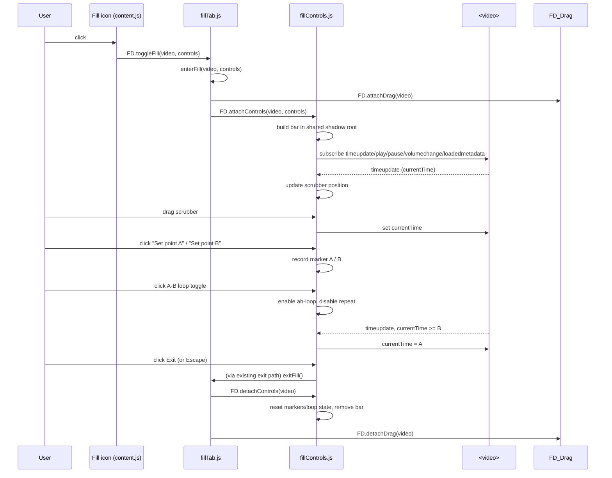

# Plan: Fill-Mode Control Bar

## Table of Contents

- [Plan: Fill-Mode Control Bar](#plan-fill-mode-control-bar)
  - [Summary](#summary)
  - [Technical Approach](#technical-approach)
  - [Component Breakdown](#component-breakdown)
  - [Dependencies](#dependencies)
  - [External / Vendor Documentation Evidence](#external--vendor-documentation-evidence)
  - [Flow](#flow)
  - [Risk Assessment](#risk-assessment)

## Summary

Add a new `extension/fillControls.js` module that owns a bottom control
bar (progress scrub, play/pause, standard repeat, A/B loop, exit) and a
restyled floating fill icon, wired into `fillTab.js`'s existing
`enterFill`/`exitFill` lifecycle exactly the way `drag.js`'s
`attachDrag`/`detachDrag` already is — same single-video-at-a-time state
shape, same `window.__fdExt` namespace convention.

## Technical Approach

This follows the exact extension pattern documented in `AGENTS.md`'s
Architecture Summary: a new IIFE file attaching functions to the shared
`FD` (`window.__fdExt`) namespace, loaded in the `<all_urls>`
`content_scripts` entry, called symmetrically from `fillTab.js`'s
`enterFill`/`exitFill` the same way `FD.attachDrag`/`FD.detachDrag`
already are (`extension/fillTab.js:53`, `:91`). No new architectural
pattern is introduced — `fillControls.js` is a peer of `drag.js`, not a
replacement for anything.

**Ownership split** (mirrors the existing separation of concerns):

- `content.js` keeps owning video discovery, the shared shadow root, and
  the floating fill-icon button's DOM node/lifecycle (`attachButtonRow`/
  `detachButtonRow`) — it changes to render one icon button instead of
  three, and stops creating its own Play/Pause/Mute buttons (those move
  into the bar).
- `fillTab.js` keeps owning the fill-mode state machine
  (`enterFill`/`exitFill`/`toggleFill`) and gains two calls:
  `FD.attachControls(video, controls)` in `enterFill`, `FD.detachControls
  (video)` in `exitFill` — same call shape as its existing
  `FD.attachDrag`/`FD.detachDrag`.
- `fillControls.js` (new) owns everything about the bar itself: building
  its DOM once per fill session (into `content.js`'s existing shared
  shadow root, passed in via the `controls` object already threaded
  through `toggleFill`), wiring video events to bar state, the A/B/repeat
  loop logic, the hover/idle show-hide timer, and tearing the bar down on
  detach. State (markers, loop mode, hide-timer id) is module-level,
  reset on every `attachControls` call, matching FR8.

**Why a new file, not folding into `content.js` or `fillTab.js`:**
`content.js`'s job is discovery/lifecycle for *every* video on the page
(fill or not); `fillTab.js`'s job is the fill state machine itself. The
bar's logic (scrub sync, loop math, idle-hide timer) is a distinct,
sizeable concern that only exists while one specific video is filled —
the same reasoning that already justified splitting drag-to-reposition
into its own `drag.js` rather than growing `fillTab.js`.

**Reused patterns:**

- Shadow-DOM-scoped `<style>` injected once (`content.js:17-35`'s
  `rowStyle` pattern) — `fillControls.js` injects its own `<style>` into
  the same shared `shadow` root, passed to it via the `controls` object
  (see Component Breakdown) rather than reaching into `content.js`'s
  module scope.
- `data-fd-role` tagging convention (`AGENTS.md` Coding Conventions).
- Event-driven UI sync off the video element itself (`play`/`pause`/
  `volumechange`/`timeupdate`/`loadedmetadata`), the same shape as
  `content.js`'s `updatePlayPauseLabel`/`updateMuteLabel`.
- The bar itself uses plain `position: fixed; left/right/bottom: 0`
  rather than `content.js`'s `ResizeObserver` + rect-tracking pattern:
  since the video is always `position: fixed; inset: 0` while filled
  (`fillTab.js`'s `.fd-fill-active` rule), the bar's own fixed
  positioning against the viewport already stays glued to it with no
  observer needed — a further simplification over the original plan,
  which is why the fill icon button (in `content.js`, tracking a
  non-fixed video) still needs `ResizeObserver` but the bar does not.
- Cover-math is *not* reused here (that's `drag.js`'s concern) — the bar
  never touches `object-position`.

**A/B loop and standard repeat mutual exclusivity (FR6/FR7):** enabling
one clears the other's *active* state (but not A/B markers themselves,
per FR7) before applying the new mode — same one-active-loop-mode
invariant `MediaPlayerState` enforces in the reference Razor component,
reimplemented as plain state flags rather than a C# record.

**Hide-on-idle (FR9):** a single `setTimeout` id in module scope,
cleared and restarted on every qualifying `pointermove`/`mousemove` over
the video or bar; suspended (not restarted) for the duration of a
scrubber drag session (tracked via the scrubber's own
`pointerdown`/`pointerup` handlers, not a global drag flag) — mirrors
the Razor component's `InteractionStarted`/`InteractionEnded` +
`HoverStarted`/`HoverEnded` split (`MediaPlayerControls.razor:259-270`),
reimplemented with native DOM events instead of Blazor `EventCallback`s.

**Icons (FR10):** inline `<svg>` strings using Bootstrap Icons' path
data (MIT-licensed, same icons already referenced by class name in
`MediaPlayerControls.razor`: `bi-play-fill`, `bi-pause-fill`,
`bi-repeat-1`, `bi-chevron-bar-left`, `bi-chevron-bar-right`,
`bi-infinity`, `bi-x-circle`, `bi-fullscreen`, `bi-fullscreen-exit`),
stored as small template-literal constants inside `fillControls.js`. No
font file, no `@font-face`, no `web_accessible_resources` change.

## Component Breakdown

**Existing files to modify:**

- `extension/content.js` — `attachButtonRow` builds one icon-only fill
  button (`data-fd-role="fill"`) instead of the current three-button
  row; drops its own Play/Pause/Mute button creation and their
  `play`/`pause`/`volumechange` listeners (that logic moves to
  `fillControls.js`); the `controls` object passed to
  `FD.toggleFill`/`fillBtn` click handler now carries only what's needed
  for `fillControls.js` to build its bar (the video, and a reference to
  the shared `shadow` root — e.g. exposing `FD.getOverlayShadowRoot()`
  from `content.js` for `fillControls.js` to call, rather than
  duplicating shadow-root creation). Fill-icon positioning changes from
  "row above the video" to "small circle anchored at the video's
  top-left corner" (still `ResizeObserver`-driven, just a different
  offset calculation).
- `extension/fillTab.js` — `enterFill` calls
  `FD.attachControls(video, controls)` alongside its existing
  `FD.attachDrag(video)` call; `exitFill` calls `FD.detachControls
  (video)` alongside `FD.detachDrag(video)`; the `controls.fillBtn`
  visibility toggle (`textContent = "Exit"` in the original design)
  becomes `hidden = true`/`false` instead — the bar's own Exit button
  (using `FD.ICONS.fullscreenExit`) already covers the exit affordance
  once filled, so the floating button hides rather than relabeling
  itself — but stays in `fillTab.js` since it already owns that button
  reference.
- `extension/manifest.json` — add `"fillControls.js"` to the `js` array
  of the `<all_urls>` entry, positioned after `drag.js` and before
  `content.js` (it must be defined before `content.js` runs, since
  `content.js` builds the fill button whose click handler eventually
  triggers `fillTab.js` → `FD.attachControls`; it must also come after
  `fillTab.js` since nothing in `fillControls.js` calls into `fillTab.js`
  at load time, so strict ordering relative to `fillTab.js` isn't
  required by call graph, but is kept adjacent to `drag.js` for
  readability — both are "attached while filled" peer modules).

**New files to create:**

- `extension/fillControls.js` — the control bar: DOM construction,
  inline SVG icon constants, video-event wiring, A/B/repeat loop logic,
  scrubber sync, idle-hide timer. Exposes `FD.attachControls(video,
  controls)` / `FD.detachControls(video)`.

## Dependencies

- None beyond what's already present — no new npm packages, no Docker
  image change. The Playwright test suite (`tests/package.json`) needs
  no new dependency since the bar uses only native DOM APIs already
  exercised by existing tests (`pointerdown`/`pointermove`, `timeupdate`,
  range inputs are not yet tested but Playwright supports them natively).

## External / Vendor Documentation Evidence

Not applicable — no vendor-documented technology decision is involved;
this is native `<video>`/DOM API usage already established elsewhere in
the codebase (`content.js`, `drag.js`), and Bootstrap Icons' path data is
used only as static, vendored SVG markup (MIT license), not as a live
dependency.

## Flow

## Risk Assessment

| Risk | Evidence | Mitigation |
| --- | --- | --- |
| Bar's pointer events accidentally reach `drag.js`'s video-level `pointerdown`/`pointermove` listeners, triggering an unwanted crop-drag while the user is scrubbing the progress bar. | `drag.js:105-109` attaches listeners directly on the `<video>` element; the bar is a sibling shadow-DOM element, but if any bar element were ever made a child of the video or the click weren't properly contained, events could bubble oddly. | Bar stays a shadow-root sibling (never a video child, per FR12/NFR); add an explicit Playwright test asserting a scrubber drag does not change `object-position` (see Validation.md). |
| YouTube's player re-render (already known to strip `fd-fill-active`, per `fillTab.js`'s `attrObserver`, `AGENTS.md` Architecture Summary) could also remove or reposition the bar if YouTube's own DOM churn touches the shared shadow host's siblings. | Documented residual risk in `fillTab.js:63-65`'s comment for the class-stripping case specifically. | Bar lives in the extension's own shadow root (never touches YouTube's DOM), so it is not subject to the same re-render risk as inline video classes; existing `attrObserver` already re-applies `fd-fill-active` independent of the bar. No new mitigation needed, but call out in Validation's manual steps to re-check on YouTube specifically. |
| Mutual-exclusion state (FR6/FR7) drifts from the button's visual "active" state if an exception or early return skips clearing the other mode. | New logic, no existing precedent to copy exactly (Razor's `MediaPlayerState` is authoritative C# state; this is a fresh plain-JS reimplementation). | Keep the loop-mode as a single `loopMode` string variable (`"none"`, `"repeat"`, or `"ab"`) instead of two independent booleans, so only one mode can ever be true at a time; add a unit-style Playwright assertion toggling both back-to-back. |
| Adding a fourth script (`fillControls.js`) to the `<all_urls>` entry's `js` array changes load order; a mistake here reintroduces the exact `FD.neutralizeAncestors is undefined` class of bug called out in `AGENTS.md`'s Coding Conventions for `ancestorOverrides.js` ordering. | `AGENTS.md`: "Any new test fixture that loads `fillTab.js` must also load `ancestorOverrides.js` first, or `enterFill` throws." | Place `fillControls.js` after `drag.js`, before `content.js`, matching the plan above; update any test fixture/helper that manually lists the script load order (`tests/e2e/helpers/serveRepoAtOrigin.js` if it hardcodes the list — verify during implementation) to include the new file in the same position. |
